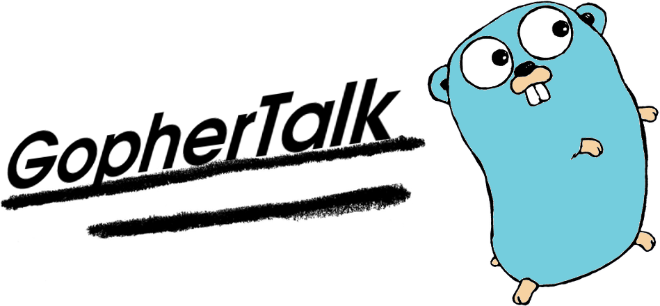
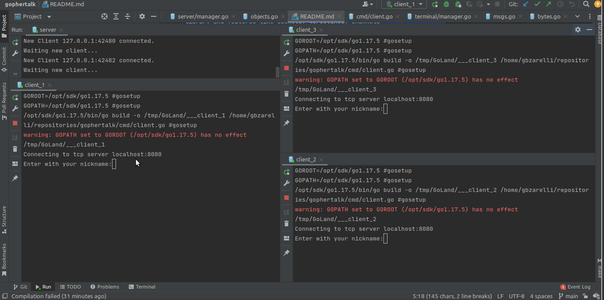

# GopherTalk

GopherTalk is a multi-user chat powered by GO to explore its standard 
library and features like sockets, goroutines, channels 
and sync package.

---

## The Project

The project was two binaries, the [server](./cmd/server.go) located in {project-dir}/cmd/server.go and the [client](./cmd/client.go) in {project-dir}/cmd/client.go

### Server

The server is responsible to maintain the channels with your clients open, and, redirect the messages to them.

The traffic between client-server-client is done by payloads in JSON formats established in the package internal / dto

Was use pure Socket channel to accept new clients. No specific protocol was used for communication.

### Client

The client just connect in the server and login with a uniq username, there is no autentication. If the username was exists in the server, its reject and asked to reconnect.

The client can talk with all people in the server or a specific

#### Commands:

- `/help`         : to show the help message
- `/users`        : for list connected users
- `/to {user}`    : to define the user to send the message
- `/all`          : to define all people to send the message

# Running

In development...